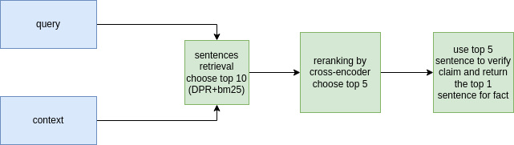

# UIT data challenge
This is code for joining uit data challenge using haystack, transformers and sentence-transformers library.
## Pipline (from fever dataset)

## Train all model
chmod +x inference/scripts.sh
./inference/scripts.sh
## Inference
```python
from inference.pipeline import Pipeline
pipe = Pipeline()
print(pipe('sau một ngày thì có thể bán được một tỷ gói mè'))
```